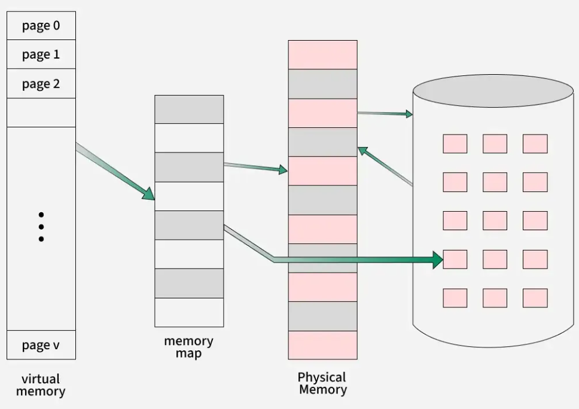

# 🐧Linux Programming

## 📘 Session 1: General Knowlegde

### 🛠️ 1. Build Process in C

A C compiler converts source files into executable binaries through **four main phases**:

| Phase           | Description                                                                 | Output File | Example Command                              |
|----------------|------------------------------------------------------------------------------|-------------|----------------------------------------------|
| Pre-processing  | Removes comments, expands macros, includes headers, handles conditional code | `.i`        | `gcc -E main.c -o main.i`                    |
| Compiling       | Converts preprocessed code into assembly instructions                        | `.s`        | `gcc -S main.c -o main.s`                    |
| Assembling      | Translates assembly code into machine code                                   | `.o`        | `gcc -c main.c -o main.o`                    |
| Linking         | Resolves function calls and combines all code into an executable             | executable  | `gcc main.o -o main`                         |

📌 To generate all intermediate files in one go, use:

```bash
gcc -Wall -save-temps source_file.c -o output_file
```

### 📚 2. Static / Shared Library

| Properties            | Static Library                                                                                   | Shared Library                                                                                                 |
|-----------------------|--------------------------------------------------------------------------------------------------|---------------------------------------------------------------------------------------------------------------|
| Linking time          | Happens as the last step of the compilation process. After the program is placed in memory       | Added during linking process when executable file and libraries are added to memory                            |
| Means                 | Performed by linkers                                                                             | Performed by operating system                                                                                  |
| Size                  | Much bigger, because external programs are built into the executable file                        | Much smaller, only one copy of dynamic library is kept in memory                                               |
| External file changes | Executable must be recompiled if external files change                                           | No need to recompile the executable                                                                            |
| Time                  | Takes longer to execute, loading into memory happens every time                                  | Faster, shared library code is already in memory                                                               |
| Compatibility         | No compatibility issues, all code is in one executable module                                    | Dependent on having a compatible library; program will not work if library is removed from the system          |

### ⚙️ 3. Makefile

A Makefile is a script used by the make build automation tool to compile and link a program.

The make program reads the contents of the Makefile and executes it.

📌 Naming conventions: Makefile, makefile, or *.mk

📐 Structure of a Makefile

```bash
target: dependencies
    command
```

target: The file to be generated

dependencies: The files required to build the target

command: The shell command to build the target (must start with a tab character)

🔁 Automatic Variables

| Variable | Description                                 |
|----------|---------------------------------------------|
| $@       | The name of the target in the current rule  |
| $<       | The first prerequisite (dependency)         |
| $?       | Prerequisites newer than the target         |
| $^       | All prerequisites                           |

## 📘 Session 2: File System

### 1. What is Linux Filesystem

A filesystem is a set of processes that control how, where, and when data is stored and retrieved from a storage device.

**Key responsibilities include:**

- Disk scheduling for multiprocess access
- Mapping blocks to files
- Organizing file layout on disk

---

### 2. Linux Filesystem Structure

The Linux filesystem is structured in multiple layers to abstract complexity and provide flexibility:

```
User Application
    ↓
  Logical FS
    ↓
  Virtual FS
    ↓
  Physical FS
    ↓
Partitions (partition 1, partition 2, partition 3)
```

- **User Application**: Uses system calls like `open()`, `read()`, `write()` to interact with files.
- **Logical FS**: Provides the user interface for file operations and manages file-related system calls.
- **Virtual FS (VFS)**: An abstraction layer that allows different filesystem types (e.g., ext4, NFS, VFAT) to be accessed uniformly.

```text
 User Application
        ↓
       VFS
        ↓
(ext2, ext3, FAT, NFS)
```

- **Physical FS**: Handles the actual reading/writing of data to storage devices.
- **Partitions**: Physical divisions on the storage device where filesystems reside.

---

### 3. Key Concepts

#### 🧩 Inode

An inode is a data structure that stores metadata about a file or directory, including:

- File size
- Permissions
- Ownership
- Timestamps
- Pointers to data blocks

#### 📁 Directory

A directory is a special type of file that maps filenames to inode numbers. It acts as a lookup table, allowing the system to locate files based on their names.

---

### 4. Relationship Between File Descriptors and Inodes

This diagram shows how file descriptors map to system-wide open file descriptions and inodes:


#### 🔹 Per-Process Open File Table

Each process maintains its own table of file descriptors (FDs). Each FD entry includes:

- Flags controlling FD behavior (e.g., close-on-exec)
- A reference to a system-wide open file description  
Defined in: `struct fdtable` (located in `include/linux/fdtable.h`)

#### 🔹 System-Wide Open File Table

This table contains entries for all open files in the system. Each entry includes:

- File offset (current read/write position)
- Access mode (read, write, read-write)
- Status flags (e.g., append, non-blocking)
- Reference to the inode object  
Defined in: `struct file` (located in `include/linux/fs.h`)

---

### 5. File Operations

#### 🔄 Common Operations

- `open()`
- `read()`
- `write()`
- `create()`
- `delete()`
- `truncate()`
- `reposition()` (e.g., `lseek()`)

#### 🔁 Data Flow During Read/Write

```
Process → File Descriptor Table → System-Wide Open File Table → Inode Table → Disk Blocks
```

#### 🧠 Example: `open()`

The kernel creates a file descriptor (e.g., `fd = 3`) in the process’s FD table.  
`fd` points to an entry in the system-wide open file table.  
That entry contains:

- File offset
- Status flags
- Pointer to the inode of the file

#### 📥 Example: `read()`

- Kernel uses `fd` to locate the system-wide entry.
- Retrieves the current offset and inode.
- Uses inode to locate the file’s data blocks.
- Reads data into the buffer.
- Updates the file offset.

> `write()` follows a similar flow, but writes data from the buffer to disk.

#### 🧱 Low-Level Write Path

```
App → write() → Kernel Space (cache, block I/O scheduler) → Storage Device (HDD/SSD/Flash)
```

This diagram shows the open file sequence:


---

### 6. File Locking

Linux supports file locking to prevent race conditions and ensure consistency when multiple processes access the same file.

**Types of locks:**

- **Advisory locks**: Processes must cooperate to respect the lock.
- **Mandatory locks**: Enforced by the kernel if enabled.

**Locking mechanisms include:**

- `flock()` — whole-file locking
- `fcntl()` — byte-range locking

Locks are stored in the system-wide open file table and managed per inode.

---

### 7. Filesystem Types in Linux

Linux supports various types of filesystems, each with its own advantages tailored to specific use cases:

| Filesystem | Description | Use Case |
|------------|-------------|----------|
| **ext4**   | Default filesystem on many Linux distributions. Supports journaling. | General-purpose for desktops and servers |
| **XFS**    | High-performance, optimized for large files and systems. | Servers, large-scale data storage |
| **Btrfs**  | Modern filesystem with snapshot, RAID, and error-checking features. | Complex data management |
| **FAT32**  | Highly compatible with Windows and portable devices. | USB drives, memory cards |
| **NTFS**   | Default filesystem for Windows. | Dual-boot systems, data sharing |
| **NFS**    | Allows file access over a network. | Internal networks, file servers |

---

### 8. Mounting and Unmounting

Mounting is the process of attaching a filesystem to the main Linux directory tree.

🔧 **Common commands:**

- `mount /dev/sda1 /mnt/data` — Mounts the device to `/mnt/data`
- `umount /mnt/data` — Unmounts the device from the system

📌 A **mount point** is the directory where the filesystem becomes accessible. The root directory `/` is mounted at boot.

---

### 9. Permissions and Ownership

Linux uses a permission model to control file access:

- **User (u)**: File owner
- **Group (g)**: Assigned group
- **Others (o)**: Everyone else

🔐 **Basic permission types:**

- `r` — read
- `w` — write
- `x` — execute

🛠 **Example:**

```bash
-rwxr-xr-- 1 alice devs 1024 Oct 15 10:00 script.sh
```

- Owner: `alice`, Group: `devs`
- Permissions: Owner has `rwx`, group has `r-x`, others have `r--`

**Management commands:**

- `chmod` — change permissions
- `chown` — change file owner
- `chgrp` — change group

---

### 10. Journaling and Consistency

Most modern filesystems like `ext4` and `XFS` use journaling to ensure consistency.

🧾 **What is journaling?**

- Logs metadata changes before applying them to disk
- Helps recover from power loss or system crashes
- Reduces risk of data corruption

---

### 11. Filesystem Management Tools

🧰 **Useful commands:**

- `df -h` — Check disk usage
- `du -sh` — View directory size
- `lsblk` — List block devices
- `fsck` — Check and repair filesystem
- `mkfs` — Create a new filesystem on a partition


## 📘 Session 3: Process

Linux manages running programs as processes, each with its own memory and lifecycle.

🧠 **Program vs Process:**

- A **program** is a passive set of instructions stored on disk.
- A **process** is an active instance of a program in execution.
- Multiple processes can be created from the same program.

---

## 1. Command Line Arguments

Linux programs can receive input via command-line arguments.

🧾 **In C:**

```c
int main(int argc, char *argv[])
```

- `argc`: number of arguments
- `argv`: array of argument strings

🛠 **Example:**

```c
#include <stdio.h>
int main(int argc, char *argv[]) {
    for (int i = 0; i < argc; i++)
        printf("Arg[%d]: %s\n", i, argv[i]);
    return 0;
}
```

---

### 2. Virtual Memory Layout



Each process has its own virtual memory space, divided into segments:


- **Text**: compiled code - read only
- **Data**: global/static variables
- **Heap**: The heap is an area from which memory (for variables) can be dynamically allocated at run time (`malloc`). The top end of the heap is called the program break.
- **Stack**: The stack is a dynamically growing and shrinking segment containing stack frames. One stack frame is allocated for each currently called function. A frame stores the function’s local variables (so-called automatic variables), arguments, and return value.


- **Bss**: uninitialized global/static variables

---

### 3. Memory Leak and Valgrind

A memory leak occurs when allocated memory is not properly freed.

🧪 **Valgrind** helps detect:

- Memory leaks
- Invalid memory access

🛠 **Usage:**

```bash
valgrind --leak-check=full ./your_program
```

---

### 4. Enviroment list
- Each process has an associated array of strings called the environment list, or simplythe environment. Each of these strings is a definition of the form name=value. Thus, the environment represents a set of name-value pairs that can be used to hold arbitrary information. The names in the list are referred to as environment variables.

```bash
#include <stdio.h>
$ SHELL=/bin/bash Create a shell variable
$ export SHELL Put variable into shell process’s environment
```


### 5. fork() and execl()

- `fork()` allows one process, the parent, to create a new process, the child. This is done by making the new child process an (almost) exact duplicate of the parent: the child obtains copies of the parent’s stack, data, heap and text segments (Section 6.3). The term fork derives from the fact that we can envisage the parent process as dividing to yield two copies of itsel
- `exit()`  terminates a process, making all resources (memory, open file descriptors, and so on) used by the process available for subsequent reallocation by the kernel. The status argument is an integer thatdetermines the termination status for the process. Using the wait() system call, the parent can retrieve this status.
- `wait()` System call has two purposes. First, if a child of this process has not yet terminated by calling exit(), then wait() suspends execution of the process until one of its children has terminated. Second, the termination status of the child is returned in the status argument of wait().
- `execve()`  loads a new program (pathname, with argument list argv, and environment list envp) into a process’s memory. The existing program text is discarded, and the stack, data, and heap segments are freshly created for the new program. This operation is often referred to as execing a new program.


🛠 **Example:**

```c
#include <unistd.h>
int main() {
    pid_t pid = fork();
    if (pid == 0) {
        execl("/bin/ls", "ls", NULL);
    }
    return 0;
}
```

---

### 5. Zombie and Orphan Processes

- **Zombie**: child has exited but parent hasn't called `wait()`
- **Orphan**: parent exits before child; child is adopted by `init`

🛠 **Example:**
